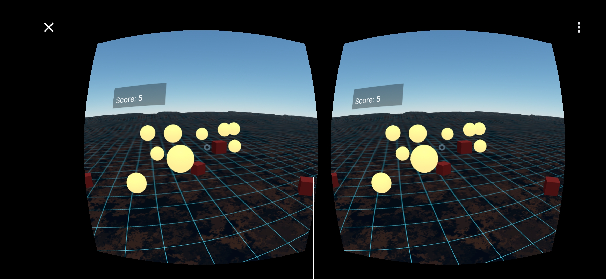

#Orbs.cure✨

**OrbsXR** — a lightweight browser-based AR + VR game built with **A-Frame** and **WebXR**.  
Players collect glowing orbs and avoid danger objects using only gaze — perfect for mobile demos and classroom presentations.

> Demo / Repo: https://github.com/ju-utsu/orbs.cure-demo  
> (https://ju-utsu.github.io/orbs.cure-demo/)

---

## 🎯 Elevator pitch
A cross-platform **A-Frame** experience delivering both VR and AR modes from a single static site.  
AR uses WebXR hit-test + anchors so spawned objects stick to real-world surfaces. Controls are gaze-based and configurable for accessibility.

---

## 🖼️ Screenshots / Demo

  

**Demo video:** `assets/media/demo_orbs.mp4`

---

## 🚀 Features
- Runs entirely in the browser (host on GitHub Pages) — no server required
- VR mode: immersive A-Frame scene with HUD, spawners and raycaster gaze controls
- AR mode: WebXR hit-test + XR Anchors for stable object placement on surfaces
- Gaze-based collection with configurable timers (orb / danger)
- Auto-spawn system with performance cap (max 21 AR objects)
- Minimal, polished grid aesthetic and responsive HUD
- Small sound effects for feedback

---

